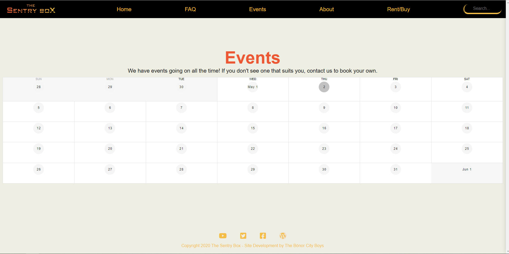

# Vue-Flask-Commerce

## This project consists of a completing engaging design and custom payment app.

- Our goal is to provide users with a simple, modern way to buy/rent games as well as allow the employees of the company to have a refined, cleaner looking interface to easily manage order, stock and payment. 

- This site as it stands contains a full 5 page site that includes a custom payment platform that was build from sratch and has the ability to add games to a table, and remove them, change the price, name of the game, and the name of the author. Stripe functionalites are built in for processing and the ability to scale the platform to suit future needs, whatever they may be.

